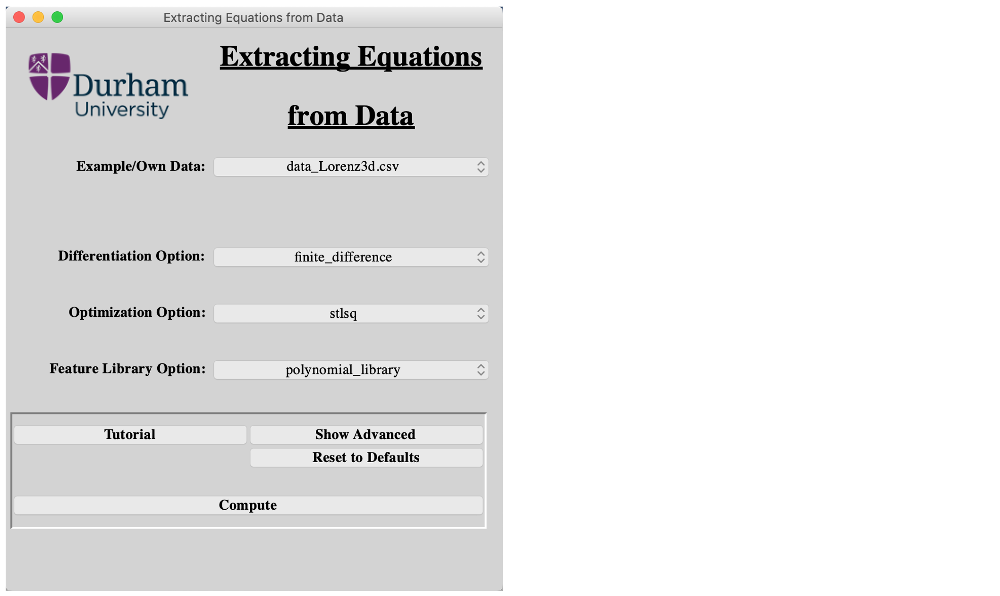
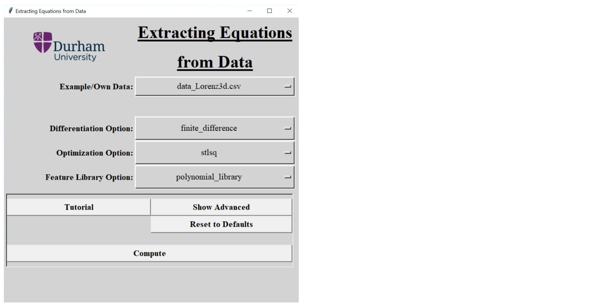
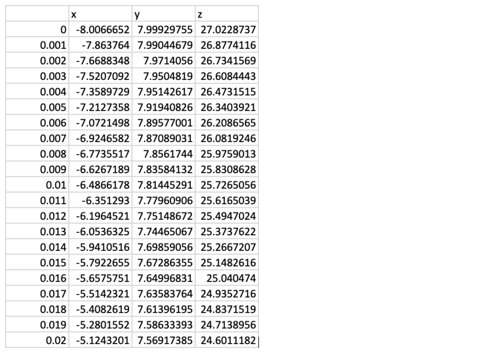

# SEED 2.0

**SEED**: **S**oftware for the **E**xtraction of **E**quations from **D**ata

## Table of contents
* [Introduction](#introduction)
* [Getting Started](#getting-started)
	* [Prerequisite](#prerequisite)
	* [Installing](#installing)
* [Usage](#usage)
	* [Running SEED 2.0](#running-SEED)
	* [Examples](#examples)
	* [Using your own data](#using-your-own-data)
* [Future developments](#future-developments)
* [License](#license)

## Introduction
SEED 2.0 is a software written in Python that allows for the extraction of governing differential equations from data. It has been written with use of the [PySINDy](https://github.com/dynamicslab/pysindy) package, written by Brian de Silva et al.

SEED 2.0 has a simple and intuitive Graphical User Interface (GUI) so that researchers in a wide variety of fields, without needing to know any programming, can analyse their data using cutting edge methods.

## Getting Started

### Prerequisite
In order to run SEED 2.0, the user must have a current Python installation, that can be downloaded from the [Python website](https://www.python.org/downloads/).

As well as the base Python installation, it is vital to install the Python modules needed for the programme to run. You can do this by running these commands in the terminal or command line:

* Mac - terminal: 

> _python3 -m pip install numpy matplotlib pysindy scipy_

* Windows - command line:

> _python -m pip install numpy matplotlib pysindy scipy_

You can also use SEED 2.0 through Jupyter Notebook. A _.ipynb_ file is included as well as the _.py_ file. The code is the same. Before running SEED 2.0 in Jupyter Notebook, it is vital to install the above Python modules needed for the programme to run.

### Installing
After following the above steps, download the source files from GitHub, save all of the files in the same folder anywhere you would like.

## Usage

### Running SEED 2.0
To run SEED 2.0, open the Python IDLE (included with the Python download) and open the file _SEED2\_0.py_. Click _Run > Run Module_ on the toolbar to run the software. If running SEED through Jupyter Notebook, open _SEED2\_0.ipynb_ in a Jupyter Notebook server and run all lines of code. 

The GUI will start up and will look like this:

* Mac:

* Windows:

After launching SEED 2.0, you can then select your data file and press the _Compute_ button to obtain your output equations.

Check the [PySINDy](https://github.com/dynamicslab/pysindy) GitHub repository for details on the optimization, differentiation and feature library options.

### Examples
There are two datasets that come with the SEED 2.0 download.

The first, called _data\_Lorenz3d.csv_, contains the data for a three dimensional lorenz system, generated from the [feature overview](https://github.com/dynamicslab/pysindy/blob/master/examples/1_feature_overview.ipynb) example file from the [PySINDy](https://github.com/dynamicslab/pysindy) GitHub repository. 

The second, called _random\_5d.csv_, contains five variables of randomly generated data. This is to show an example of the output of SEED 2.0 when a system with no underlying relationship is tested. It is clear that the SINDy algorithm can't settle on sparse coefficients to represent the model.

### Using your own data
In order to use your own data with SEED 2.0, you must save the data as a _.csv_ file with one column of time series data, and further columns containing the data for each recorded variable. The first row of your _.csv_ file must be the names of each variable.  
An example of a three variable system is shown below:

There are two ways to run SEED 2.0 with your own data file.

The first is to select _Own Data_ in the _Example/Own Data_ dropdown selection box on the main panel of the GUI, then using the file browser, you can then select the file containing your data.

You can also save the data file in the data folder containing the example data files that came with the SEED 2.0 download, then select it in the dropdown after running SEED 2.0.

## Future Developments
As well as the current features of PySINDy integrated into SEED 2.0, there are a number of features currently in development to be released in the near future. This includes but is not limited to:

* Integration of the Lasso method for system optimization
* Saving the output model to a file
* The ability to use a custom feature library
* The ability to combine feature librarys
* Integrating SINDy with control

## License
The MIT License is used for this software. For more information see: [License info](https://github.com/M-Vause/SEED2.0/blob/master/LICENSE)
